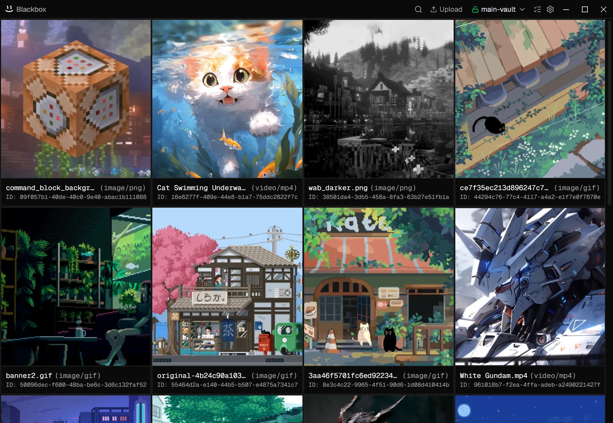

<p align="center">
  
</p> 
<h1 align="center">Blackbox</h1>
<p align="center">
  Local-first encrypted file vault for Windows and Linux
</p>
<p align="center">
  <a href="https://github.com/Twaish/blackbox/releases">Download</a>
  · 
  <a href="https://github.com/Twaish/blackbox/issues">Report Bug</a>
  · 
  <a href="https://github.com/Twaish/blackbox/issues">Request Feature</a>
</p>
<p align="center">
  
</p> 

Blackbox is an open-source, local-first encrypted file vault for Windows and Linux. 

Files and metadata are encrypted locally using AES-256-GCM. Vaults are stored as standard directories on your filesystem, allowing you to choose where data lives and how it is backed up or synchronized.

## Features

* Local-first storage
* AES-256-GCM authenticated encryption
* Passphrase-based key derivation using scrypt
* Encrypted file metadata
* Streaming encryption and decryption for uploads and file access
* Vault directories stored directly on disk
* Change vault passphrases without re-encrypting stored files
* Open source (GPL-3.0)

## How It Works

Each vault contains:

```text
vault/
├── manifest.json
├── data/
│   ├── <file-id>
│   └── ...
└── meta/
    ├── <file-id>
    └── ...
```

### Encryption Model

Blackbox uses a two-key design:

1. A Key Encryption Key (KEK) is derived from your passphrase using `scrypt`.
2. A random Data Encryption Key (DEK) is generated when the vault is created.
3. The DEK is encrypted using the KEK and stored in the vault manifest.
4. Files and metadata are encrypted using the DEK and AES-256-GCM.

This allows passphrases to be changed without re-encrypting every file in the vault.

### File Format

Encrypted files are stored as:

```text
[ IV | Ciphertext | Authentication Tag ]
```

Where:

* IV = 12 bytes
* Authentication Tag = 16 bytes
* Cipher = AES-256-GCM

## Storage

Blackbox does not require a database.

Vault contents are stored as encrypted files directly on the filesystem, making them easy to back up, move, and synchronize using external tools.

## Synchronization

Blackbox does not provide built-in cloud storage or synchronization.

Because vaults are standard directories, they can be used with tools such as:

* Syncthing
* Nextcloud
* Dropbox
* Google Drive
* iCloud Drive
* OneDrive

When using third-party synchronization services, encrypted vault data may be copied to those services.

## Security Notes

* Passphrases are not stored in vault manifests.
* Vault metadata is encrypted at rest.
* Encryption and decryption are performed locally.
* Losing a vault passphrase may make encrypted data unrecoverable.
* Blackbox does not provide password recovery functionality.

## Platform Support

* Windows 10+
* Windows 11
* Linux

## Installation

Download the latest release from the project's Releases page.

Alternatively, build from source:

```bash
git clone https://github.com/Twaish/blackbox.git
cd blackbox
npm i
npm run build:release:local
```

## Development

```bash
npm i
npm run dev
```

Build production binaries:

```bash
npm run build:release:local
```

## License

Blackbox is licensed under the GPL-3.0 License.

See the `LICENSE` file for details.

## Disclaimer

No software can guarantee complete security. The security of your data depends on factors such as passphrase strength, device security, operating system integrity, and backup practices.

Review the source code and evaluate whether the project meets your security requirements before storing sensitive information.
